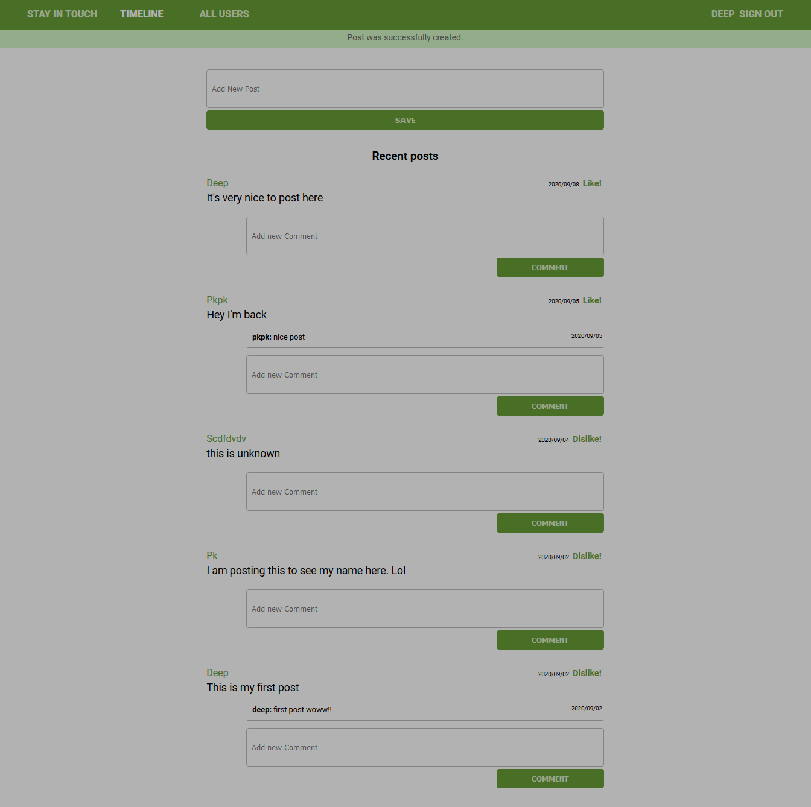

# Scaffold for social media app with Ruby on Rails

> This repo includes intial code for social media app with basic styling. Its purpose is to be a starting point for Microverse students.

<div align="center">

[](https://github.com/Dipeshtwis/ror-social-scaffold/tree/feature/frendships_v2)
[](https://github.com/Dipeshtwis/ror-social-scaffold/tree/feature/frendships_v2/issues)
[](https://github.com/Dipeshtwis/ror-social-scaffold/pulls)

</div>

## 📝 Contents

<p align="center">
<a href="#with">Built with</a>&nbsp;&nbsp;&nbsp;|&nbsp;&nbsp;&nbsp;
<a href="#sc">Screenshot</a>&nbsp;&nbsp;&nbsp;|&nbsp;&nbsp;&nbsp;
<a href="#gs">Getting started</a>&nbsp;&nbsp;&nbsp;|&nbsp;&nbsp;&nbsp;
<a href="#author">Author</a>
</p>

## 🔧 Built with<a name = "with"></a>

- Ruby on Rails v5.2.4
- Ruby (Version: 2.7.1)

## Screenshot <a name = "sc"></a>




## Getting Started <a name = "gs"></a>

To get a local copy of the repository please run the following commands on your terminal:

```
$ cd <folder>
```

~~~bash
$ git clone git@github.com:Dipeshtwis/ror-social-scaffold.git
$ cd ror-social-scaffold
$ bundle install
$ rails db:migrate
~~~

## To run Test

~~~ruby
$ rpsec --format documentation

~~~

## ✒️  Authors <a name = "author"></a>


👤 **Dipesh Kumar**

- Github: [@Dipeshtwis](https://github.com/Dipeshtwis)
- Twitter: [@97deepeshkumar](https://twitter.com/97deepeshkumar)
- Linkedin: [dipeshtwis](https://www.linkedin.com/in/dipeshtwis/)


## 🤝 Contributing

Contributions, issues and feature requests are welcome!

Feel free to check the [issues page](https://github.com/microverseinc/ror-social-scaffold/issues).


## 👍 Show your support

Give a ⭐️ if you like this project!


## :clap: Acknowledgements

- Microverse: [@microverse](https://www.microverse.org/)
- Social Media repository : [repo](https://github.com/microverseinc/ror-social-scaffold)


## 📝 License

TBA
